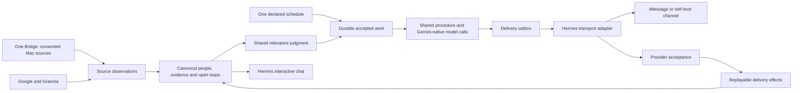

# Runtime architecture

One page on what runs inside the container, who owns what, and which files cross between them. The
code is the source of truth; this is the map you read first. For *why* a nudge fired, see
[HOW-SOTTO-DECIDES.md](HOW-SOTTO-DECIDES.md); for every env var, [RAILWAY.md](../RAILWAY.md).

> **Prefer to click than to read?** [playground-architecture.html](playground-architecture.html) is
> this page made explorable — a layered node map of the same modules, threads and shared files,
> with six saved views, a clickable drawer per node, and the shared-file sheet; every number on it
> is interpolated from the same rules island the drift guard checks against code.
> [playground-feedback-loops.html](playground-feedback-loops.html) does the same for the six
> self-improvement loops, each badged CLOSED, RECORDING or PLANNED. Both are single self-contained
> files: open them from disk, or visit `/static/playground-architecture.html` on a running deploy.

## The spine — read this first

Daily and first-use briefs follow **gather → compose → validate → commit essential memory →
deliver**, with ancillary learning queued separately. Meeting prep, the proactive watcher and
the midday digest have their own procedures and share the source, relevance and delivery rules.

| Stage | Owner | In one sentence |
|---|---|---|
| **gather** | [`_shared/scripts/gather_google.py`](../sotto-chief-of-staff/_shared/scripts/gather_google.py) (+ `gather_granola.py`, `_shared/lib/attachments.py`, the Bridge's `read_local`) | Deterministic Python pulls the raw material; no model is involved. Two facts it reads that nothing read before (Sep 2026): the stale-sent lane (`gather_stale_sent` — one `in:sent` search plus one `threads.get` per candidate: is the last word on the thread still yours?) and your own answer to each invite (`normalize_event.my_response`). |
| **compose** | [`_shared/scripts/compose_brief.py`](../sotto-chief-of-staff/_shared/scripts/compose_brief.py) | One Gemini call turns the gathered payload into prose and actions, plus the optional critic/revise pass — and the debts code can see are minted by code beside them (`_stale_debt_actions`, `_rsvp_actions`): an email you sent that nobody answered, an invite you haven't answered that is nearly here. The model's own row for the same thread or event wins. |
| **validate** | [`_shared/lib/brief_validate.py`](../sotto-chief-of-staff/_shared/lib/brief_validate.py) | Checks structure, identifiers and deterministic obligations; findings guide the critic/revision pass. These checks cannot prove every model judgment correct. |
| **commit essential memory** | [`_shared/scripts/learn_step.py`](../sotto-chief-of-staff/_shared/scripts/learn_step.py) `--phase essential` | Applies extracted knowledge and merges actions into continuity before returning the brief for delivery. Failure retries these writes against the saved artifact. |
| **deliver** | `receiver.py` → `outbox.py` → `adapters/hermes/runtime_api.py` | The outbox persists the artifact, checks its due time and current eligibility, then claims the brief marker at the send seam. A missing composed archive cannot claim the day. Structured provider acceptance completes delivery; retrying a known result does not recompose it. |
| **finish learning** | [`_shared/scripts/learn_step.py`](../sotto-chief-of-staff/_shared/scripts/learn_step.py) `--phase ancillary` | A durable background job runs `draft_outcomes.py`, `style_extract.py`, `granola_graph.py` and `prewarm_graph.py --sync-contacts`. It merges results into `briefs/<date>.<kind>.learned.json`; queued or failed ancillary work cannot suppress a valid brief. The default `--phase all` retains the standalone six-writer command. |

**The model judges meaning; code governs interruption and action authority.** Native Gemini classifies relevance, and the shared funnel applies cadence, consent, freshness and delivery policy. Hermes still exercises model discretion during interactive conversation; an adapter boundary cannot guarantee the quality of its replies. The funnel is documented rule by rule in [HOW-SOTTO-DECIDES.md](HOW-SOTTO-DECIDES.md), and
the seven things that can start a nudge are the producer table at the top of that page.

**Two reads bypass the host CLI, on one shared client.** The Hermes `google-workspace`
`google_api.py` is installed from upstream, not from this repo, and it lacks two verbs this system
needs: a Gmail *draft* (`google_action.py`), and message *attachments* — its `gmail get` flattens
the message to a body and discards the MIME part tree, so filenames aren't reachable through it at
any price. Both go straight to the Gmail API on the SAME `google_token.json` the CLI authenticates
with, through one builder — `gather_google._gmail_service`, which `google_action.py` imports rather
than copying. The attachment half converts what it fetched through
[`_shared/lib/attachments.py`](../sotto-chief-of-staff/_shared/lib/attachments.py), the owner of the
lane's three caps for both the fetch side and the prompt side: *an attachment Sotto can read becomes
text under its email; one it can't is named, never guessed.* Conversion is in-process and local —
no hosted OCR, no API key, no env var (see [HOW-SOTTO-DECIDES.md](HOW-SOTTO-DECIDES.md) §
*Attachments*).

### The open-loop path — input to outcome

This is the complete path for a Granola commitment. It deliberately has one model judgment and
small deterministic guards around it, rather than a second workflow engine:

```text
Granola notes / summary / transcript
  → gather_granola: meeting_id + exact start/end + source text
  → compose_followup: owner_is_user + verbatim source_snippet + optional existing_anchor_key
  → apply_commitments:
       meeting id + copied quote + named owner + action/deliverable words must match source (or drop)
       same meeting + direction + source snippet → same occurrence
       validated live same-direction anchor     → merge with that open loop
       otherwise                                → create a new open loop
  → continuity ledger → brief / Loops page / proactive watcher
  → triage verdict with decision_id
  → receiver send → delivery receipt with the same decision_id
       delivered → count “already nudged” and finalize a chase/handoff
       failed     → neither
```

Capture does **not** wait for a confirmation turn: private bookkeeping is written when the grounded
extraction succeeds. Both composition and the actual write recheck four mechanical model claims
against the gathered meeting: its id exists, the supporting quote was copied, that quote names the
claimed owner, and it contains the obligation's action/deliverable words. Ambiguity drops the
item instead of opening a loop. Exact occurrence identity handles reruns; the model may suggest at
most one semantic merge, and code accepts it only if that anchor is live and points in the same
direction. There is no fuzzy-matching subsystem. Source-backed Granola commitments close explicitly,
so an ordinary reply, an old creation date, or the user's own chase cannot silently erase them.

## Accepted work and delivery



`events/work.sqlite3` owns **work before composition completes**. The existing
`events/outbox.json` remains the only owner of sends and their retries. These are sequential
stages with an idempotent handoff, not competing delivery ledgers. A job has a stable ID, due
time, useful deadline, attempt count and renewable lease. Its exact completed output is committed
before handoff, so a crash there does not buy another composition. Duplicate queue items retain
ownership even if a later valve batch groups them differently. Raw inputs/results are removed
from terminal work rows; diagnostic metadata lasts seven days.

The receiver runs at most two jobs concurrently, with at most one background job. Interactive
Hermes is a separate supervised process. Due work normally has priority; background work waiting
30 minutes receives a turn without occupying both slots. This keeps history and secondary learning
from starving under sustained traffic. Each lease has a distinct owner token, so an expired worker
cannot commit a replacement worker's result. The queue lives on the existing tenant volume.

Daily jobs can recover within four hours of their declared time. The separate ten-minute
wake-folding window describes a currently composing brief, not the lifetime of accepted work.
Normal brief preparation starts ten minutes early. The outbox's `not_before` holds its completed
text until the declared time; consent and relevant Calendar facts are checked again before claiming
the brief marker. A changed context revision permits a fresh composition. A slow essential model
call or prolonged outage can still miss the deadline; health exposes outstanding/failed work
rather than claiming punctuality it cannot prove.

Source outcomes distinguish successful empty reads from partial, unavailable and disabled reads.
A failed Calendar refresh retains the last good observation and cannot manufacture cancellations.
A revoked source is excluded from cached inputs and contextual memory. Observation timestamps and
coverage remain separate from the time a cache file is rewritten.

After provider acceptance, an outbox row drops its message text and retains `effects_pending`
until the associated bookkeeping succeeds. Retrying those effects never resends the message.
Chases, proactive seen state, intention completion and detached offers activate after acceptance.
An offer must correspond to the actual delivered question; multiple unanswered questions require
clarification. Acceptance is a provider receipt, not proof that the user read the message. A network
failure after an uncertain send remains an explicit ambiguity; universal exactly-once delivery
cannot be promised without a provider idempotency contract.

Optional research uses prepared/cached results. Notes in `cache/brief-granola.json` are reusable for
24 hours, with a freshness warning beyond 30 minutes, and expire under the one-day retention rule.
Welcome voice/identity seeders share a 20-second allowance. Essential knowledge and continuity writes
precede brief delivery; draft outcomes, voice learning, meeting-note learning and Contacts synchronization
have their own durable follow-up, which may finish before or after transport acceptance. Their failure
cannot suppress an already valid brief. Historical
learning leaves capacity for the existing Dreamer; explicit user corrections remain authoritative,
and silence is not negative feedback or permission for an external action.

## The two processes

The receiver owns scheduling, accepted work and delivery; Hermes owns interactive chat and its
model/tool loop. `adapters/hermes/start.sh` resolves the delivery channel once for both. Managed
Cloud uses Photon/iMessage; self-host keeps its configured channel. Existing Telegram/WhatsApp
pairing remains bounded and an unlinked Telegram leaves the receiver running without starting a
gateway that would consume the next pairing message.

The shipped container first takes `runtime_lock.py`'s lifetime lock on the tenant volume. Managed
boot verifies the real mount and explicit tenant/volume identity receipt before starting writers.
The adapter retains both essential process IDs and supervises them as process groups. An unexpected
exit (including zero) recycles the whole instance; shutdown terminates and reaps both groups. It
does not hide a dead receiver behind a healthy gateway or mask child failure with a bare `wait`.
The receiver owns and stops its detached worker groups. No extra supervisor service is required.

`runtime_api.py` contains Hermes-specific argv, structured sends, paths, sessions, personal routines
and timezone reconciliation. The receiver owns the durable job and outbox stores, and the adapter
returns provider acceptance metadata rather than making business delivery claims. The separate
control credential stays out of Hermes and worker environments. That inheritance boundary does
not sandbox an agent that has unrestricted access to tenant files or processes.


## Receiver modules

All under `runtime/trigger-receiver/`; most modules are stdlib-only, while managed pairing uses the
image’s pinned cryptography dependency. `receiver.py` loads its hook-based helpers with
`importlib` and injects `HOOKS` — late-bound lambdas over its own globals — so no module ever
imports the receiver back.

| Module | Owns |
|---|---|
| `managed.py` | Managed activation/source checks, granted Google scope receipts, and the one-time source notice policy. Missing or foreign tenant state holds scheduled briefs, including Bridge wake triggers; self-host behavior is unchanged. |
| `onboarding.py` | Durable first-use reservation and delivery acknowledgement; resumes after failure, preserves established installations |
| `brief_runner.py` | One deterministic daily/first-use procedure in Cloud and receiver-based self-host: durable artifact and inputs, essential knowledge/continuity writes, exact chat text, deferred ancillary learning |
| `procedure_runner.py` | Shared deterministic digest and relationship-pulse procedures; reviewed digest coverage advances only after delivery acceptance |
| `work_queue.py` (shared library) | SQLite ownership of accepted work until output is handed to the outbox; stable input IDs, bounded leases/retries, two worker slots with at most one background worker |
| `receiver.py` | The HTTP surface (`/health`, `/trigger`, `/bridge/*`, `/mcp`, `/setup*`, `/google/*`, `/connect/*`, `/debug/*`), brief trigger dedup, the brief schedule (`crons.json`'s `runner: receiver` jobs), the event funnel's dispatch half, the setup wizard page, and every skills-tree subprocess it forks |
| `dashboard.py` | The Window: `/app`, `/app/login`, `/static/*`, `/api/*` — sessions, CSRF, CSP, lockout, the JSON API, and every write lever (facts, loops, prefs, cadence, graph, voice, run-now, golden labels); Cadence also shows scheduled one-shots and read-only `user-*` Hermes routines |
| `calendar_context.py` (copied from `_shared/lib/` by Docker) | Shared human-attendee normalization and explicit user participation. Explicit context notes with the exact same interval and a unique matching meeting subject attach to that meeting as `supporting_context`; their descriptions remain available for prep, without creating a second busy block or invite. Calendar diffs only nudge for declines in the user's one-to-one meetings; prep and docket exclude resource rooms. |
| `calcache.py` | The ONE calendar cache — the `gather_google.py --skip-gmail` fork, its 10-min TTL, the refresh thread that writes `cache/calendar_today.json`, the post-meeting tap detector, and the calendar-diff detector (declines, last-minute invites, moves, cancellations → `calendar_change` events into the funnel). A meeting the user DECLINED is dropped before the served list (the Today view and the funnel's in-meeting hold never see it) while the raw wire events keep it for the diff |
| `connectors.py` | The connector registry, both kinds: remote-MCP OAuth 2.1 (discovery → DCR → PKCE → token file) for the Connect tiles, and the key-based search providers it renders read-only beside them — **and `write_text`/`write_json`, the one atomic-write helper the whole image uses** |
| `outbox.py` | The durable delivery outbox — `events/outbox.json`, the idempotency key, the retry backoff, the per-kind expiry, and the drain heartbeat. **Nothing Sotto says is marked delivered until the channel says so; what fails waits its turn instead of dying.** |
| `retention.py` | THE table of what the volume keeps and for how long — every TTL, the three policies that apply them, and the guard that keeps the graph, the ledger and the corpus off every rule. It owns no clock: `receiver._retention_tick` fires it once a local day from the cron thread. **Retention is machinery, not an instruction a run can decline.** |
| `tzchain.py` (a copy of `sotto-chief-of-staff/_shared/lib/tzchain.py`, placed here by the Dockerfile) | THE timezone chain — `SOTTO_TIMEZONE → TZ → the wizard's config/settings.json → UTC` — resolved by one file in every runtime: the skills import it as a sibling, the receiver and dashboard load it by path (this copy in the image, the original in a checkout), and `start.sh` runs it. Four hand-mirrored copies drifted on their last rung (server local vs UTC), invisible on Railway and a day off on any other machine after 5pm (Sep 2026). |
| `sessions.py` | Shared session-archive procedure, invoked at boot and nightly. It delegates Hermes session discovery and archive commands to `adapters/hermes/runtime_api.py`; runtime paths and CLI details stay inside the adapter. |
| `relay.py` | The reverse-MCP relay: the Mac long-polls `/bridge/poll`, Hermes calls `/mcp` locally, no tunnel |

The directory also carries `keys.py`, a byte-identical vendored
copy of `_shared/lib/keys.py`. The two runtimes must compute the same ids (`queue_key`,
`sample_hash`) for "nudge me now" and the Voice card to address the right row, and the receiver
image has to render those surfaces with no skills tree on the box — so it copies rather than
imports, and `tests/test_docs_drift.py` fails the suite the moment the copies diverge.

The shared Hermes `notification_config.py` reconciles platform lifecycle notices during
container boot and local installation. Shutdown, restart, startup and interrupted-cron
notices stay in operator logs on Telegram, Photon and configured channels; normal replies
and actionable source/provider failures retain their existing delivery paths. The scheduled
digest runner uses the checker's default CLI action, with a real subprocess regression check.

## Background threads

These loops contain their own failures. The bounded work pool separately leases accepted jobs;
restarting a thread or process does not erase accepted work.

| Thread | Cadence | What it does |
|---|---|---|
| Gmail poll (`receiver.start_gmail_poll_thread`) | `SOTTO_EMAIL_POLL_SECS`, default 90s | Claims nothing while polling; feeds new mail through the same funnel as Bridge events, then acknowledges ids only after the receiver durably accepts them |
| Release valve (`receiver.start_valve_thread`) | `receiver.VALVE_INTERVAL_SECS_DEFAULT` = 900s | Forks `triage_event.py --valve` so a nudge held during cooldown/quiet/catchup can still get out |
| Sotto cron (`receiver.start_cron_thread`) | `receiver.CRON_TICK_SECS` = 60s | Reads the shared daily, weekly and interval declarations and durably admits due work. Briefs start up to ten minutes early with delivery held until due; missed daily jobs can catch up within four hours. Stable work IDs survive restart; the work queue owns bounded retries. The same heartbeat starts quiet memory work, renews the managed model lease, runs retention at 3:30 AM local, and archives sessions through the Hermes adapter. Timezone changes clear the process-local fired stamps; durable delivery markers still prevent a second accepted daily brief. |
| Delivery outbox drain (`outbox.start_drain_thread`) | `outbox.DRAIN_INTERVAL_SECS` = 60s | Retries every message the channel hasn't acknowledged — backoff doubling from 60s to a 900s cap, then `failed` (a brief, loudly, when its local day ends) or `expired` (a nudge past 240 min). After acceptance, effects retry five times without resending, then quarantine with their receipt and replay inputs retained. |
| Update check (`receiver.start_update_check_thread`) | daily | One GitHub fetch → `cache/update_check.json` (the ONE writer); silent on an unstamped dev build |
| Work dispatch (`receiver.start_work_thread`, thread `sotto-work-dispatch`) | every 5s, or the moment a job is admitted or finishes (`_WORK_WAKE`) | Claims due jobs from `events/work.sqlite3` under a fresh per-claim owner and starts one `sotto-work` thread per claim, within the queue's two worker slots |
| Work execution (`receiver._work_one`, thread `sotto-work`, one per claimed job) | for the life of the job | Runs the declared procedure (or reuses a saved result), saves the exact output, renews the lease once more, hands the text to the outbox, then `finish`es or `fail`s the job for bounded retry |
| Work lease (`receiver._work_one.keep_lease`, thread `sotto-work-lease`, one per running job) | every 30s while its job runs | Renews the job's 120s lease; a renewal the queue refuses (the lease was recovered by another claim) ends the keeper, and the worker's own pre-handoff renewal then fails rather than delivering twice |
| Session archive (`receiver._session_archive_tick`, thread `sotto-session-archive`) | once a local day at the retention sweep slot (3:30 AM), spawned from the cron tick | Archives every Hermes chat session through `sessions.py` on its own thread, so one slow CLI call cannot delay the brief window the cron thread is in |
| Calendar refresh (`calcache.start_refresh_thread`) | `SOTTO_CALENDAR_REFRESH_SECS`, default 900s | Refreshes the snapshot, rewrites `cache/calendar_today.json`, asks `tap_tick()` which meetings just ended, and `change_tick()` what changed about the imminent calendar |

## Subprocess boundaries

Longer skill procedures run in subprocesses; lightweight shared source, queue and delivery helpers
are imported directly. Python procedures use `sys.executable` and inherit `SOTTO_DATA` through the
receiver's environment policy. The tree is located by
`receiver._find_sotto_script`: `SOTTO_SKILLS_ROOT` → the Hermes layout → the repo-relative source
tree, resolved once per script name.

| Caller | Script | Shape |
|---|---|---|
| `receiver.run_triage` | `event-triage/scripts/triage_event.py` | events JSON on stdin → verdict JSON on stdout, synchronous, 30s |
| `receiver.run_valve` | `event-triage/scripts/triage_event.py --valve` | verdict JSON on stdout, 30s |
| `receiver._poll_gmail_once` | `event-triage/scripts/poll_gmail.py` | event list on stdout, 180s |
| `dashboard._run_skill_cli` | `_shared/knowledge/knowledge_edit.py` · `preferences.py` · `style_extract.py --confirm` · `event-triage/scripts/triage_event.py --promote` (via `receiver.run_promote`) | `{"ok": …}` on stdout, 30s — ONE subprocess policy for the whole write surface, so every dashboard edit rides the identical code path the same instruction typed in chat would |
| `calcache._run_calendar_gather` | `_shared/scripts/gather_google.py --skip-gmail` | writes legacy event data plus a source-result receipt, 60s; only a complete successful observation replaces the authoritative snapshot |
| `receiver._seed_snapshot_from` | `_shared/scripts/compose_brief.py --seed-snapshot` | daemon thread, 120s — a wake-push that arrives after the day's brief already delivered, or within `receiver.BRIEF_CRON_WINDOW_MIN` (10) minutes of its cron while that run is still composing, composes nothing; its payload is folded into the local snapshot by the brief's own snapshot writer, and the funnel surfaces the catch-up |

Accepted background work enters through `receiver._spawn_and_deliver`, which commits a job before
returning. The bounded worker executes the declared Python procedure or adapter-owned Hermes
command, renews its lease, and saves the exact output before handing it to `receiver._deliver_text`.
The outbox persists that result under its stable run ID before the first send attempt.
`adapters/hermes/runtime_api.py` owns the transport call: an exit code alone is insufficient;
the adapter requires structured success and a provider message ID. This records provider acceptance,
not device delivery or reading. Failed or uncertain sends remain retryable; acceptance followed by
a process crash can still produce a duplicate without a provider idempotency contract.
This is also where deliver-once
stopped being a prompt: a brief-kind row proves it owns `briefs/<date>.<kind>.delivered` before the
channel is asked — no marker and the row claims it with its own run id, another run's id and the row
goes `superseded`, receipted and never sent (Aug 30, 2026: the evening brief went out twice because
the skill's own claim step was skipped). Before it claims at all, the row must have a composed brief
behind it — `briefs/<date>_<kind>.json`, which `compose_brief.py` archives before printing a word —
or it goes `failed` on the spot as `not_a_brief`, unclaimed, so the lane that can still compose is
not stood down by an improvised recap (Sep 2, 2026). Silence is a token, not a hope: a spawned
run with nothing to deliver replies the `NO_NUDGES` sentinel, which the seam records as an empty
run instead of sending — "say nothing and end the turn" was an instruction models reliably
ignored, and three "all clear" messages in one evening proved it (Aug 2026). Email asks, every
other channel links — and the seam enforces that half too: a `mailto:` never leaves the box
(`receiver._strip_mailto` — a markdown link keeps its label, a bare URL and its "tap to send"
line go), because every run delivered here is unattended and an unattended run's email path IS
the Gmail-draft ask (Sep 4, 2026: a nudge arrived with the ask and a 200-character percent-encoded
mailto Telegram rendered as plain text).
The Hermes `google-workspace` skill's `setup.py` is an eighth, forked for Google auth only.

**Adapter/plumbing variables** (script-to-script, never a user setting — they are deliberately
absent from RAILWAY.md's table): `SOTTO_DATA` (the volume path, `/data` in the image),
`SOTTO_RUN_SKILL` and `SOTTO_SKILLS_ROOT` (above), `SOTTO_UNATTENDED` (set to `1` on every skill run the receiver spawns — the seam `google_action.py`'s send gate reads; the interactive gateway never carries it), `SOTTO_MCP_TOKEN` (the ROOT bearer,
which `start.sh` sets from `BRIDGE_TOKEN`; the Bridge's lanes — relay dial-in, event ingestion,
wake-push — and the operator surfaces take the root, while `/mcp` takes only
`receiver.derive_mcp_token(root)`, the one-way HMAC bearer `configure_mcp.py --derive-mcp` hands
Hermes at boot, so the prompt-injectable agent never holds the trust anchor), `SOTTO_TRIGGER_PORT` / `SOTTO_TRIGGER_BIND` (the
receiver's port and bind address, used only when Railway's `PORT` is absent — local runs get `8787`
on `127.0.0.1`), and `SOTTO_BRIDGE_BIN` (read once by `adapters/hermes/install.sh`: an explicit path
to a `sotto-bridged` engine, overriding both locations it probes for local mode — the built binary
and the one bundled in `/Applications/Sotto Bridge.app`).

## The shared `$SOTTO_DATA` files

Everything that crosses a process boundary crosses as a file on the volume. Receiver-owned JSON
snapshots use `connectors.write_json` (tmp at 0600 → `os.replace`); skill-owned transaction files
use the same temp-then-replace pattern, and the continuity ledger adds one cross-process lock around
read/modify/write. JSONL records are append-only and bounded. **"skills" below means the
`sotto-chief-of-staff` scripts, running in a different process.**

| File | Writer | Reader |
|---|---|---|
| `.sotto-volume.json` | `managed_volume.py initialize` | managed boot and recovery verify the mounted tenant identity |
| `.sotto-runtime.lock` | `runtime_lock.py` | supervisor and offline recovery refuse concurrent writers |
| `.sotto-recovery-hold.json` | `recovery.py restore` | managed boot holds a restored tenant until explicit activation |
| `accounts.sqlite` | account broker | encrypted pending account/device handoff and bounded sign-in sessions on the broker's separate volume |
| `proxy.sqlite3` | model proxy | per-tenant lease, rate, reservation and content-free usage ledger on the proxy's separate volume |
| `config/onboarding.json` | receiver `onboarding.py` | receiver first-use tick and scheduled hold |
| `config/model-lease.json` | adapter `model_lease.py` | receiver renewal heartbeat and operator recovery diagnostics |
| `config/cloud-pairing.sqlite` | receiver `cloud_pairing.py` | device grant redemption, authentication, listing and revocation |
| `config/source-state.json` | shared `source_context.py` | consent-aware source readers and history learning |
| `knowledge/history-state.json` | `memory_cycle.py` | diagnostics/setup: initial bounds, progress, provider-request revision latch and bounded work receipt |
| `knowledge/dreamer.json` | `dreamer.py` | changed-file selection and review receipt |
| `knowledge/conflicts.json` | `knowledge_update.consolidate` | `knowledge_query.py` renders unresolved pairs with their source facts |
| `setup_code` | receiver (boot) | receiver, `start.sh` |
| `config/photon-activation.json` | managed Photon adapter (first owner DM) | managed receiver gate and owner destination check |
| `Mac: cloud-policy.json` | personal pilot operator | Bridge readers and event watcher |
| `config/managed-capabilities.json` | managed receiver after Google OAuth and Bridge consent | managed receiver gate (missing state means zero sources) |
| `config/managed-status.json` | receiver after outbox acceptance of `status:no-sources` | receiver's cron heartbeat (one-time notice) |
| `config/settings.json` | receiver (`/setup/timezone`) | receiver, dashboard, `start.sh`, skills (`timeutil`) |
| `briefs/<date>.<kind>.claim` · `briefs/<date>.<kind>.delivered` | receiver (the `.claim`; and the `.delivered` when the send seam's gate claims it), skills (`brief_marker.py --claim`) | receiver (trigger dedup, the cron-window fold, and the outbox's deliver-once gate — the `.delivered` file's CONTENT is the claiming run's id), skills (`proactive_scan.py`) |
| `briefs/<date>.<kind>.payload.json` | receiver | skills (`compose_brief.py`) |
| `briefs/<date>_<kind>.json` | skills | dashboard |
| `briefs/<date>.<kind>.named.json` | skills (`compose_brief.py`) | skills (`proactive_scan.py` — which open loops that brief NAMED, so a chase is held only for a genuine double-tell) |
| `briefs/<date>.<kind>.learned.json` | skills (`learn_step.py`, phases `essential`, `ancillary`, or legacy `all`) | Receiver diagnostics: per-writer `ok`, `skipped`, `queued` or `failed`; essential and ancillary durable background work may finish after a valid brief is delivered |
| `events/seen.json` | receiver | receiver (idempotency ring — Bridge events, keyed `(source,rowid)`) |
| `events/gmail_seen.json` | receiver, through `poll_gmail.py --ack` after accepted ingest | skills (`poll_gmail.py`) — a provider fetch alone never advances the cursor, so a receiver failure is retried rather than lost |
| `events/work.sqlite3` | shared `work_queue.py` | receiver workers lease bounded accepted work and retain terminal results |
| `events/work-inputs/brief-<run>/` | receiver `brief_runner.py` | resumable brief and background learning procedures |
| `events/usage-<job>.json` | shared model metrics writer | receiver attaches content-free usage to delivery receipts |
| `events/last.stamp` | receiver | receiver (`/setup` liveness line) |
| `events/bundle-<random>.json` | receiver | skills (the `sotto-event` one-shot); atomically staged with thread/process-unique names and seven-day cleanup |
| `events/last_digest.txt` | skills (`digest_check.py --stamp`; on an in-agent install the brief that wins the deliver-once claim), receiver (`_on_delivered` — the brief the channel ACKED, not the one that claimed: a claim whose send fails and retries into the afternoon must not hide the morning from the 12:30 digest) | skills (`digest_check.py` window), dashboard (`/api/cadence` context line) |
| `events/queue.jsonl` · `events/surfaced.jsonl` | skills (`triage_event.py`) | dashboard (the Record + the waiting room), skills (`compose_brief.py` reads only verdicts whose `decision_id` has a delivered receipt) |
| `events/drafts.jsonl` | skills (`action_links.py` — every tap link built with a draft) | skills (`draft_outcomes.py`, run directly by `learn_step.py` each brief: matched against the queue's `is_from_me` signals → outcomes.jsonl + style confirms) |
| `events/delivery.jsonl` | receiver (the ONE writer) | dashboard (the Record, source `delivery`), skills (`compose_brief.py`) — closing rows carry `usage` and correlated `decision_ids` |
| `events/outbox.json` | `outbox.py` (the ONE writer) | receiver (the retry drain), dashboard (`/api/runs` — the pending/failed line) — one row per message Sotto composed, written BEFORE the first send attempt and flipped to `delivered` only on the channel's ack |
| `events/delivery-effects-<run>.json` | shared `delivery_effects.py`, merging procedure contributions transactionally | Receiver result commit and outbox handoff: source/Calendar eligibility, original coverage cutoff, chase/handoff, proactive/intention and offer effects; only delivery-dependent effects activate after provider acceptance |
| `events/sends.jsonl` | skills (`google_action.py`) | you — one metadata-only line per real-effect **attempt** (send, reply, calendar create/delete/RSVP), allowed or refused, carrying `payload_sha256` so "what did Sotto send?" isn't answered by a prompt's promise |
| `cache/calendar_today.json` | calcache | In-meeting hold and delivery eligibility: daily projection, opaque event IDs, actual observation time, status and completeness; an older or failed observation cannot prove a newly observed meeting disappeared |
| `cache/meeting_taps.json` | calcache | calcache (exactly-once tap record) |
| `cache/research_<date>.json` | skills (`research_attendees.py`) | dashboard (`/api/research` cards), skills (`compose_brief.py` joins it) |
| `cache/brief-granola.json` | receiver `brief_runner.py` | resumable brief preparation and composition |
| `cache/hermes-version.json` | `start.sh` | receiver (Integrations page) |
| `cache/update_check.json` | receiver (daily update check — the ONE writer) | receiver (`/setup` line, `/api/overview` banner), skills (`compose_brief.py` update line) |
| `cache/update_notice.json` | skills (`compose_brief.py`) | skills (`compose_brief.py` — the once-per-version marker) |
| `connectors/<service>.json` | connectors (OAuth write; `/setup` Disconnect deletes) | skills (`connector_tokens.py`), receiver (presence only) |
| `connectors/<service>.error` | skills (the gather; `/setup` Disconnect deletes) | receiver (`/setup` reconnect hint) |
| `dashboard_sessions.json` · `dashboard_audit.jsonl` | dashboard | dashboard |
| `decks/<view_id>.pdf` · `decks/<view_id>.json` | skills (`docsend_fetch.py` — the pdf is the deck's pages assembled, the json is the read cache that stops a re-ask logging a second view) | you (dashboard `GET /api/decks/<id>.pdf`), skills (cache hits, incl. unattended) |
| `knowledge/master.md` | `_shared/knowledge/master_file.py` (the ONE writer — user-stated words; gateway confirms, dashboard edits shell out to it) | skills (`compose_brief.py`, `compose_meeting_prep.py` — always in the prompt), gateway chat, dashboard (Learned page card) |
| `knowledge/last_local_snapshot.json` | skills (`compose_brief.py`) | skills — the RAW Bridge payload, overwritten each brief and never deleted; its 24h TTL stops reuse, not storage ([DATA-FLOW.md](DATA-FLOW.md)) |
| `knowledge/snapshots/<date>.json` | skills (`compose_brief.py` — dated archive copy, last write of the day wins, pruned after 60 days) | `tools/build_golden_corpus.py` — the corpus's message history; one live snapshot only holds ~a day |
| `corpus/<version>/` | `tools/build_golden_corpus.py` (`--out`; refuses to write on a leak), maintainer Labels route (`/app#labels`, absent from main navigation) (`labels.yaml` only — the owner's judgments) | `evals/run_golden.py` (scoring), maintainer Labels route (`/app#labels`, absent from main navigation). CONFIDENTIAL REGARDLESS — never leaves the volume |
| `knowledge/relationship_state.json` | skills (`relationship_pulse.py`) | skills (`compose_brief.py`, `triage_event.py`'s VIP floor), dashboard (the attention queue) |
| `knowledge/<kind>/*.md` · `style.json` · `outcomes.jsonl` | skills | dashboard (read), skills |
| `logs/compose_brief.log` | skills | receiver (`/debug/brief-log`) |
| `proactive/<date>.json` | skills (`proactive_scan.py`) | skills (`proactive_scan.py`) — the once-per-day nudge dedup; a read-modify-write, so both producers take `triage_event._locked` on it |
| `proactive/wake_run.last` | receiver (`handle_proactive_wake`) | receiver — its *mtime* is the sleep→wake throttle, nothing is read from inside it |
| `proactive/retune_offer.last` | skills (`proactive_scan.py`) | skills (`proactive_scan.py`) — the retune-offer cooldown stamp |
| `proactive/mute_offers.json` | legacy file; no current writer | no current reader — automatic mute offers and their no-op call seam are removed |
| `proactive/pending_offer.json` | `pending_offer.py`: staged questions become active through post-acceptance `delivery_effects` | Gateway reply resolution uses the delivered question, provider receipt and target. An unmatched reply leaves the offer unchanged; multiple unanswered questions require clarification. An action-bearing offer retains `payload_sha256`, which `google_action.py --offer-bound` must match before acting. |
| `intentions.jsonl` | skills (`schedule_wakeup.py`) | skills (`proactive_scan.py`), dashboard (`/api/cadence`) — append-only one-shot recipes, folded by id; an optional loop anchor cancels the recipe when the loop closes |
| `hermes/platforms/whatsapp/session/creds.json` | the Hermes gateway (**not** Sotto) | receiver (`_whatsapp_status`) — the positive "this account is linked" probe; `start.sh` (the same file decides whether a redeploy keeps WhatsApp as the channel) |
| `whatsapp-pairing.txt` · `google-auth-url.txt` | `wa_pair.py` / `start.sh` | receiver |
| `telegram-link.json` | `telegram_link.py` (the ONE owner of the Telegram handshake — run by `start.sh` at boot, or by hand: [CHANNELS.md](../CHANNELS.md) § Telegram setup) | `start.sh` (`--boot` reuses the captured id for this token, else captures it, and forwards it to Hermes as `TELEGRAM_ALLOWED_USERS` + `TELEGRAM_HOME_CHANNEL`), receiver (`_telegram_status` — the "this chat is linked" probe behind the wizard tile and the nudge gate). It holds the bot token, so 0600 |
| `preferences.json` | `preferences.py` (chat and dashboard invoke it) | skills, dashboard |

Every row but the last is **one-way**: exactly one writer, and readers that never write. That is the
property that keeps the two processes from needing a lock.

`preferences.json` has one writer: `preferences.py`, invoked by chat and dashboard for mutes,
VIPs, tone and snoozes. Learn calls `draft_outcomes.py` directly for outcome receipts and voice
confirmation. It no longer infers approval defaults, dismissal hints or edit counters. Historical
fields and suppression tombstones remain on disk without being applied or exposed as controls;
there is no storage migration. Concurrent preference edits still take the shared JSON lock.

## Who produces a nudge, and who owns a memory

The container half above is the *plumbing*; the spine at the top of this page is the product. Two
small tables finish the map — the same writer/reader treatment as the `$SOTTO_DATA` table, applied
to the two questions it doesn't answer.

**Nudge producers** — seven, and only seven, things can start a nudge. (Full version, with the gate each
one rejoins: [HOW-SOTTO-DECIDES.md § Who can produce a nudge](HOW-SOTTO-DECIDES.md#who-can-produce-a-nudge).)

| Producer | Entry point | Cadence |
|---|---|---|
| Bridge events | `receiver.handle_events` | push, `SOTTO_EVENTS_TICK_SECS` on the Mac |
| Gmail poll | `receiver._poll_gmail_once` | `SOTTO_EMAIL_POLL_SECS` (90s) |
| Release valve | `receiver._valve_tick` → `triage_event.release_valve` | `receiver.VALVE_INTERVAL_SECS_DEFAULT` (900s) |
| Post-meeting tap | `calcache.tap_tick` → `receiver._dispatch_meeting_tap` | on the calendar refresh tick |
| Calendar diff | `calcache.change_tick` → `receiver._dispatch_synthetic` | the same refresh tick — declines, last-minute invites, moves, cancellations of imminent meetings |
| Proactive watcher | `proactive_scan.main` → `triage_event.triage` (in process, one bundle; due one-shot intentions are one input to this producer) | the `*/15` cron |
| "Nudge me now" | `dashboard._post_cadence` → `receiver.run_promote` → `triage_event.promote_one` | you, on the Cadence page |

**Memory owners** — every durable thing Sotto remembers has exactly one writer. (Shapes:
[contracts/exhaust-schema.md](../contracts/exhaust-schema.md), which names the owning script per row.)

| Memory | Lives at | Owner (the only writer) |
|---|---|---|
| The people/company graph | `knowledge/*.md` | `_shared/knowledge/knowledge_update.py` (`knowledge.py` is its model + serializer) |
| Grounded research (people **and** companies) | same files | `meeting-prep/scripts/persist_prep.py` and `_shared/scripts/prewarm_graph.py` — both *through* `knowledge_update.apply()`; there is no second writer for either file type |
| Verified X identity + public-profile provenance | person files above | `_shared/scripts/x_connectivity.py` — exact handle lookup only, then *through* `knowledge_update.apply()`; immutable `x_user_id`, handle alias history, and the 90-day negative cache are durable, while Posts/bookmarks stay in the run's temporary prep payload |
| Ambiguous X identity suggestions | `knowledge/x_link_suggestions.json` | `_shared/scripts/x_connectivity.py`; a weak or already-owned match is proposed here instead of being silently attached |
| Meeting attendance + Apple Contacts identity | same files | `_shared/scripts/granola_graph.py` (who you sat with) and `_shared/scripts/prewarm_graph.py --sync-contacts` (every email/phone as an identifier, the card's notes + birthday) — both *through* `knowledge_update.apply()` |
| User-initiated graph edits | same files | `_shared/knowledge/knowledge_edit.py` — which routes *through* `knowledge_update.apply()`, so a dashboard edit and a texted correction are byte-identical |
| Open loops (the continuity ledger) | `knowledge/continuity/*.md` | `morning-brief/scripts/continuity_resolve.py` owns the locked, atomic write API; brief extraction, `apply_commitments.py`, and user edits in `knowledge_edit.py` all write through it (`ledger_io.py` is the shared read side) |
| The master memory file (who the user is, the people around them, their standing Procedures — always in every brief/prep prompt; the gateway reads it in chat; seeded by setup's four questions; editable on the dashboard's Learned page) | `knowledge/master.md` | `_shared/knowledge/master_file.py` — user-stated words only, gateway confirms before writing, dashboard edits shell out to the same CLI; size-capped so "always in context" stays honest |
| Stated preferences | `preferences.json` (`explicit` block) | `_shared/scripts/preferences.py` |
| Writing style | `style.json` | `_shared/scripts/style_extract.py` |
| Relationship analytics | `knowledge/relationship_state.json` | `relationship-pulse/scripts/relationship_pulse.py` |
| The Record (every verdict) | `events/surfaced.jsonl` · `events/queue.jsonl` | `event-triage/scripts/triage_event.py` |
| Outcomes | `outcomes.jsonl` | `_shared/scripts/log_outcome.py` |
| One-shot intentions | `intentions.jsonl` | `_shared/scripts/schedule_wakeup.py` |

Reading is unrestricted; writing is not. One writer per file is what lets two processes share the
volume with no lock.

**An interrupted graph update finishes the next time anything touches the graph.** Every write under
`knowledge/` goes through one temp-then-`os.replace` primitive (`knowledge.write_text_atomic`), so a
crash can never leave a person file truncated — `open(path, "w")` truncates first, and that window is
somebody's whole memory. Single files are only half of it: a relation is stored on BOTH people, a
merge writes the survivor and deletes the loser and repoints everyone who pointed at it, and a
re-key renames a file every other file's edges name. Those batches write their op list to
`knowledge/.journal.json` before touching the first file and remove it after the last;
`knowledge_update.graph_lock()` — the critical section every writer entry point opens with — replays
whatever it finds there first. Every journaled op is idempotent, so replaying a batch that already
finished changes no bytes, and a journal nobody can parse is logged and cleared rather than left to
block every future write. Nothing is said unless a repair actually happens.

### The research loop — what a spent token has to leave behind

> **Every token spent on research must leave behind a durable, structured, correctable fact — and
> nothing situational is ever stored.** (CLAUDE.md § Standing bars.)

Research is the most expensive thing Sotto does, so it is the one loop that must compound. Three
grounded call shapes go out through the ONE search seam (`_shared/scripts/web_research.py` — per
capability, the first provider with a key present wins; the three ladders are in
[MODELS.md §5c](MODELS.md)); all three come back through
`persist_prep.py` into `knowledge_update.apply()`:

| Call | What it buys | Where it lands | Read back as |
|---|---|---|---|
| Pass A — profile (5 attendees/call) | title, company, bio, one-line company summary | person fact, conf 0.55, `source: web_research`, + `last_researched` | the person's `known` line, and `profile_is_fresh` skips them for 30 days |
| Pass B — 90-day recency sweep (3/call) | dated, source-URLed activity + public personal texture | person facts, conf 0.6, `source_ref` = the page | the person's `known` line, injected as "do NOT repeat any of this" |
| Focus — `--focus`, ONE person, ONE call | what the company builds, the founder story, the market, traction | **the COMPANY file**: `## About` (replaced) + `## News` (URL-deduped), `updated_by: web_research`, `last_researched` | `knowledge_update.company_knowledge()` → the focus prompt's "already on file, do NOT re-derive it" block |

The company half is why the deep dive is worth its call twice: it is knowledge about an
*organization*, so parking it on whichever human was researched that morning means the next person
from that company arrives cold. `company_knowledge()` is its one read side — for the next research
run, and (through `knowledge_query.py`) for the brief's **Company Context** block.

### What the brief reads back — `knowledge_query.py`

The read side of all of the above, and the one place the retrieval question is answered:

| Emits | From | Gated by |
|---|---|---|
| `person_knowledge` — the compact packed block per person | `knowledge/people/*.md` | Current participants from consented `--local`, `--gmail`, `--calendar` and active loops, resolved through canonical aliases. The standalone `--relevant-days 7` fallback applies only when no input files were supplied. |
| `company_knowledge` — About + the 3 newest news lines, ≤5 companies | `knowledge/companies/*.md`, via `knowledge_update.company_knowledge()` | today's attendee email domains + the packed people's `company`, deduped by file |
| `contact_index` — the identity map | EVERY person file | ungated: it is what resolves a phone and an email to one person |

`mtime` says when a file was last *rewritten*, which was never the same question as "does this
person matter today" — under it, someone who emailed you this morning packed nothing and the model
re-derived what the graph already knew.

Two things deliberately do NOT persist, and both are correct:

- **Situational output** — talking points, openers, angles. The meeting-prep prompt writes them
  fresh from durable facts every run, for free. The research prompts no longer *ask* for them
  (`conversation_hooks` was deleted at the schema, not hidden at render time), because inventing
  advice costs output tokens and restates the fact it points at.
- **`$SOTTO_DATA/cache/research_<date>.json`** — a 7-day render cache for the dashboard's research
  cards. The durable half of that same output already went to the graph.
- **Recent X Posts and matching owner bookmarks** — fetched only for upcoming attendees and handed
  to the current brief/prep through mode-0600 `/tmp/sotto_x_context.json`. They never enter the
  graph, research cache, relationship state, or event ledger; the next run overwrites the handoff.

**Correctability** is the constraint that keeps the loop honest. A person fact is corrected with
`knowledge_edit.py --op correct`, and the one thing research can never learn — that an unsaved phone
number belongs to a person — is supplied with `--op add-identifier`, which refuses an identifier
already on someone else's file rather than moving it (two files sharing one identifier is what the
auto-merge reads as proof they are one human). A company has no facts map (its on-disk shape stays
byte-compatible with the Mac app's `knowledge_files.rs`), so its one correctable field is the
About paragraph — `--op company-about`, through the same `apply()` lane research writes through,
from chat or from the dashboard's company page. The write stamps `updated_by: user_edit`, and
research declines to overwrite it: a correction you made stays made. The same rule covers the
*name-merge suggestions*: `--op merge-dismiss` ("these really are two people") tombstones the pair
in `knowledge/merge_suggestions.json`'s `dismissed` list, because the suggestions are recomputed
from the files on disk on every apply and would otherwise ask again tomorrow.

## Where the schedule lives

`adapters/hermes/crons.json` is the ONE schedule declaration and
`adapters/hermes/reconcile_crons.py` is the ONE Hermes desired-state implementation. Cloud boot and
the receiver's live timezone change both call that reconciler; it replaces Sotto system jobs by
parsed job id and always fences `user-*` routines. The install adapters consume the same declaration
for their host-specific setup. See [adapters/README.md](../adapters/README.md) for its field contract.

**Who runs a job is a field, not a second file.** All Sotto system rows currently use
`"runner": "receiver"` in both Cloud and receiver-based self-host: morning/evening briefs,
weekly relationship pulse, proactive watcher and midday digest. The receiver handles fixed daily
`M H * * *`, fixed weekly `M H * * D`, and `*/N * * * *` intervals on its minute heartbeat.
Briefs use `brief_runner.py`; digest and pulse use `procedure_runner.py`; other skill jobs use the
adapter-owned runner. All enter the durable work queue and existing outbox. The reconciler removes
old Hermes registrations for these system rows while preserving user-created `user-*` routines.

## Managed pilot model and messaging boundary

The isolated Cloud pilot uses the same pinned Hermes runtime as self-host. `adapters/hermes/hermes.commit` is the actual source pin, passed to the vendored installer and verified at build and managed boot. `managed_config.py` reconciles the Photon plugin, owner allowlist, custom chat route, and removes stale direct model keys from Hermes' persisted environment. The launcher removes the keys before the receiver starts. `sotto_photon/` wraps the upstream adapter through its plugin registration API; owner DMs establish the activation receipt, groups/strangers are rejected, and adapter sends are limited to the owner or the recorded owner DM. This is an adapter policy, not an OS sandbox against a model with shell access.

`adapters/hermes/send.py` requires an unskipped JSON success with a provider message ID for every receiver outbox send in managed and self-host modes. It proves provider acceptance, not delivery to a device. Direct receiver startup runs the same capability preflight as boot and installation; there is no exit-code-only fallback.

Managed boot keeps the root supervisor while `managed_exec.py` drops receiver and gateway to the
shared unprivileged `sotto` UID, preserving their existing 0600 shared files. `control_vault.py`
captures and removes the control credential before runtime imports; the receiver becomes
nondumpable before importing its code and resolves managed skills only from root-owned `/app`.
This protects the control secret and executable code from the gateway. It is not a sandbox against
same-UID modification of tenant data or denial of service; the Linux built-image smoke is required.

`photon_probe_compat.py` applies one hash-checked compatibility patch to the pinned sidecar's synthetic message read classifier: only the exact GUID validation carrying Photon proxy provenance and gRPC INVALID_ARGUMENT is accepted as a server round trip. Authentication, transport and other failures remain inconclusive. A different source hash fails closed; upgrading the pin requires reviewing/removing this patch.

`cloud/model-proxy/server.py` is a separate pilot service and volume. Its `proxy.sqlite3` ledger stores tenant ID, route, model, timestamp, reservation, status and token counts, never prompts or responses. Two fixed surfaces share one tenant bearer: `/openai/v1/chat/completions` for Hermes; `/native/v1beta/models/{model}:generateContent` for all Sotto pipeline calls. `gemini_transport.py` changes destination and authentication only and refuses direct-key fallback in managed mode. Admission accounting is deliberately not an invoice; the owner has disabled the pilot allowance cutoff while retaining usage records. The receiver renews the existing bearer’s expiry to 30 days through `/v1/lease/renew` using an independent control credential. The proxy stores only the lease expiry and token hash; `enabled: false` blocks both requests and renewal. Bearer-byte rotation remains an operator change.

The live owner pilot uses Google web OAuth, device-bound Bridge enrollment and source consent; the registered-account/browser implementation below is still under review; automatic fleet provisioning and cohort readiness remain pending. The personal pilot records Google consent after verifying the granted scopes; scheduled briefs remain held until activation and at least one recorded source connection. See [managed pilot status](CLOUD-PILOT.md).

System jobs use the receiver in Cloud and receiver-based self-host. The weekly relationship pulse runs at 9 a.m. Monday in the user’s timezone. All managed scheduled jobs wait for messaging activation and a connected context source, then share the receiver’s outbox and silence handling.

Managed Google authorization lives in `adapters/hermes/google_setup.py`: owner-approved Gmail/Calendar/Contacts read/write grants, managed web consent with a desktop loopback fallback, persisted PKCE state, and atomic 0600 Hermes-compatible token files. The receiver records only granted sources after its authenticated OAuth exchange. Self-host keeps its existing Google setup path. No runtime dependency installation occurs in the managed auth adapter.

Personal Cloud Bridge deployments additionally read local `cloud-policy.json` from the existing Sotto support directory. An explicit source allowlist gates each reader before database access; every supported Bridge reader, including Contacts, can be explicitly enabled; unconsented readers and Bridge sends are blocked. The Sotto identity exclusion covers iMessage history, per-handle, unread and event reads as well as phone calls, FaceTime and WhatsApp identities. Bridge’s Cloud onboarding and grouped source settings write this policy at mode 0600 and report consent plus successful reads to the receiver. A destination change clears the prior destination credential before deleting its policy, so returning to self-host cannot briefly reconnect with the old Cloud credential.

Bridge cold-start pairing is queued until its store and menu-bar anchor exist. Supervisor restarts invalidate old child-exit callbacks, preventing an old credential from spawning a second outbound engine after pairing.

### Shared brief execution

`receiver._managed_brief` dispatches wake, cron and dashboard brief jobs in both supported hosting
modes to `runtime/trigger-receiver/brief_runner.py`. The procedure stores private resumable inputs
and artifacts under `events/work-inputs/brief-<key>/`. It gathers current local and Google context,
reuses prepared research/notes, queries participant memory, resolves continuity, and composes.
Knowledge and continuity writes run as `learn_step.py --phase essential`; ancillary learning is a
separately queued job. Only the composer's exact chat text reaches the outbox.

Retries reuse the saved artifact and original observation cutoff. Current permission and Calendar
revisions, including invalidated prior generations, determine when a fresh composition is needed.
The receiver owns job IDs, duplicate claims, declared delivery time, acceptance receipts and retries.
Explicit nonstandard runner overrides retain their compatibility path. The shared `lib/google_cli.py`
decoder recognizes Hermes' empty Gmail-search sentinel without swallowing authentication errors.

The proxy settles successful standard 3.8 chat reservations to reported input plus the full
model output ceiling at verified 2026 introductory prices. Missing usage, failed/ambiguous
calls and native/grounded calls retain their original reservation. This is conservative
admission accounting, not an invoice; the user’s overall $50 test authorization is unchanged.

Concurrent Gmail attachment fetches each own and close their Google API client. Sharing its httplib2 transport across worker threads caused TLS memory corruption in the live personal Cloud gather. The cohort size, attachment budget and result order are unchanged.

### Managed iMessage presentation and Gmail draft capability

The managed Photon registration uses the shared `chatfmt.to_imessage` renderer for both interactive
replies and standalone receiver deliveries. Startup copies that one library beside the plugin; no
second formatter is maintained. Messages receives plain text, readable web URLs and compact handled
lists, while canonical brief archives keep their complete content. Encoded email links are replaced
with a copy-to-Gmail instruction. The registration also overrides upstream's Markdown capability hint.

`google_action.py capabilities` reports the saved OAuth grants without making a network call or
exposing tokens. The draft skill checks this before offering Gmail storage. Managed `gmail-draft`
refuses before contacting Google unless compose/modify access is granted, and a successful save
requires a Google draft ID. Read-only Gmail is still connected; missing draft access does not
misreport it as disconnected. Failed saves preserve the text instead of returning a mailto link.

### Cloud account and device connection

`cloud/accounts/server.py` owns OIDC identity and pending bootstrap state on a separate private
SQLite volume. It adopts the configured tenant; the receiver's `cloud_pairing.py` owns device-bound
grant redemption and immutable account binding. Only `adapters/hermes/google_setup.py` knows how
to install Google credentials for Hermes. The broker erases its encrypted pending Google credential
after the instance accepts it. The active token remains a private authorized-user JSON on the tenant
volume; application-level encryption and fleet provisioning remain unimplemented.

The Bridge's `CloudSignIn.swift` persists a P-256 signing key in Keychain, completes Google consent
in the browser, then redeems the pairing grant without a user-visible token. `CloudConnectionView`
shares the existing app with self-host and stores the product tier separately from local/remote
agent topology. Local source choices write the existing fail-closed cloud-policy file; the app
reports successful source reads and consent through authenticated `/cloud/consent`. The receiver
rejects new event/wake payloads from disabled sources before staging or triage. Offline Macs retain
established capability; a configured source without a successful read does not open brief readiness.
Per-device relay credentials can now be revoked through the receiver’s control-authenticated API.
This revokes Bridge access, not Google consent, historical data or existing browser sessions.
Historical source-specific purge, dashboard exchange and the iCloud mirror remain deferred. See `cloud/accounts/README.md` for the exact pilot contract and limitations.

Bridge keeps its unfinished Cloud sign-in polling credential and device challenge in Keychain for the 15-minute sign-in window. Retrying resumes that session; temporary network errors, rate limits and server failures retry during polling and device pairing. Successful pairing or expiry clears the pending credential.

The shared `SOTTO_REACTIONS` setting also controls Photon processing Tapbacks through Hermes: 👀 while processing, 👍 after successful reply delivery, 👎 after processing/delivery failure, and no reaction after cancellation. These are best-effort conversational status indicators, never evidence that a draft was saved or an email sent.

The shared Photon adapter delays typing for two seconds, then uses Hermes' turn-owned refresh
loop until completion or interruption. Isolated startup/progress callbacks cannot flash the
indicator. The loop refreshes every two seconds without Photon's upstream five-second throttle,
while retaining Hermes' approval pauses, bounded calls and stop/cancellation cleanup. Quick replies
use only the Tapback and reply. This behavior applies to Cloud and self-host.

The model proxy distinguishes a durable pilot allowance stop (`402`, `sotto_budget_exhausted`) from upstream rate limits (`429`). The managed Hermes adapter gives the allowance stop its own truthful message and coalesces repeated budget notices during a gateway session; a successful ordinary reply re-arms that notice. Failed notification sends remain retryable. The allowance is not reset or increased by this error handling.

A tenant can explicitly set `budget_cents` to null to disable admission budget enforcement. Accounting continues unchanged; authentication, credential expiry and model/route restrictions still apply.

Cloud and self-host expose the same 11 Mac readers. Managed source consent maps Chrome/Safari IDs to their history and search-query payload fields and ties contact totals to Contacts consent; unknown sources remain rejected. Enabling a source changes future reads without resetting conversation memory or learning. The personal comparison pilot enables all 11 readers and the existing proactive-scan and midday-digest schedules. Availability is reported from actual reads; enabling a reader does not claim its database is present.

The personal Cloud comparison uses the established Telegram agent settings: the identical Sotto persona block without the stock Hermes identity preamble, Gemini 3.8 Flash, medium reasoning and 60 agent turns. Its previous canonical people/company/continuity records, explicit preferences and writing-style samples are imported using the existing graph and style writers; newer Cloud records win conflicts. Credentials, outbound queues and raw Telegram chat transcripts are not part of that import. Granola receives a separate Cloud OAuth connection.

Managed persona refresh belongs to `managed_config.reconcile`; the legacy append/refresh path is self-host-only.


#### One product core, two deployment modes

Cloud and self-host consume the same `sotto-chief-of-staff/` skill pack, receiver, contracts and Bridge source. The Cloud pilot branch is a staging branch for PR #755, not a permanent release fork. Product fixes belong in shared scripts; transport quirks belong in the channel adapter regardless of hosting. `sotto_photon/` provides shared formatting and Photon behavior, with managed-only tenant guards. `photon_setup.py` installs this adapter for either mode; container startup applies the same idle-stream policy for any Photon delivery channel. Native Google RSVP follows credential availability, not hosting mode. Each instance still owns its own personal data; importing a baseline is not ongoing cross-instance memory synchronization.

`relationship_importance.py` reads dated evidence stored by the existing relationship pulse in `knowledge/relationship_state.json` and explicit VIP preferences. The proactive scanner and People skill consume that same classification. No second model, daemon or relationship database is added. Deployment mode and chat channel do not affect gift eligibility.

Each relationship-pulse calculation builds the people index once and shares that snapshot across email identity and per-person graph lookups. The next calculation rebuilds it, so edits remain visible without repeatedly parsing the entire graph for every contact.


`_shared/references/relevance.md` owns the semantic bar across briefing and nudging. The shared
`relevance.py` loader injects it into the brief's existing native extraction; the critic quotes the
expanded template. Tier 1 and the digest's bounded conversation review call the same judgment
helper through the existing native model route. Digest review happens before the delivery cap and
considers subsequent outgoing answers. No new persistent store or tenant-specific skill copy exists.

PR #755 targets the canonical `main` branch. The release path is: review and merge the pilot work
there, then generate the public self-host distribution with `prepare-public-repo.sh`; deployments
choose the same reviewed source revision. The generator now fails if any skill, reference prompt
or backend implementation differs between source and distribution. Cloud-only auth/provisioning
stays in adapters/control-plane code. Updating a pilot branch does not upgrade existing self-host
instances; those adopt the next published release, with their own credentials and personal state.

## First useful look and continuous context (pilot implementation)

`receiver._background_context_tick` rides the existing minute heartbeat. Once context and the
owner's delivery channel are ready, `onboarding.tick` reserves a first-use run and invokes
`brief_runner.py` with `kind=welcome` in either hosting mode. It gives local voice and identity seeders one shared 20-second allowance
before the normal composer; slower learning continues in the ancillary job. Public attendee research stays on the ordinary prep
schedule; the welcome selection is empty. The composer requests up to three useful findings, a
proposal in observed voice, and one explicit next-step command. It omits routine loop/update
appendices. An existing morning/evening delivery marker identifies an established installation.
The welcome has its own archive/claim; only channel acknowledgement completes onboarding. A
20-minute onboarding reservation, 30-minute retry spacing and three attempts per UTC day bound
first-use admission; the work queue separately leases and retries accepted execution. The
scheduled brief is held while that first look is arriving, without claiming the normal daily slot.

Every 15 minutes the same heartbeat starts the quiet `memory_cycle.py` process, with the same
unattended environment as other receiver work. It returns `NO_NUDGES`. No second agent, scheduler,
provider adapter, or hosting-specific skill pack is introduced. Native Gemini remains the pipeline
provider in both modes. Each cycle reads at most three pages, rotating iMessage/WhatsApp/Gmail.
For self-host, `gemini_transport.background_learning()` uses a request-local context to route only
this cycle through the existing native model proxy and adds the finite-budget requirement. Missing
proxy credentials hold before any source fetch; HTTP 402 preserves the current page cursor and
skips the rest of that cycle, including Dreamer. Foreground requests remain on their configured
direct BYOK routes. The exact owner choice `SOTTO_BACKGROUND_UNMETERED=true` permits direct
unmetered background BYOK. Managed routing and its explicit null-budget pilot policy are unchanged.
The cycle first authenticates to `/v1/capabilities/background-budget`, a content-free versioned
read of the same ledger; missing support (including an old proxy's 404), null budget, exhausted
allowance or invalid credentials holds before source access. The request header repeats this check
inside the actual reservation transaction so concurrent spend cannot race the preflight.
The initial window is 42 days; subsequent frozen windows collect new context. Bridge `read_history`
uses row-id keyset cursors and stable source IDs, separate from live watcher cursors. A blank or
excluded-message page can advance. Gmail uses its actual API page token and the existing token
builder, with no attachments or writes. Failed reads/extractions keep the old checkpoint.

`context_learning.py` binds durable facts to supplied message references. Discussions, decisions,
commitments and historical asks are not stored; actionable work remains owned by the live ledger. It reviews
up to 160 direct-message records per page (Gmail pages have up to 100), with at most 1,400 text
characters per record. Group history contributes to the existing activity/voice readers where
authorship is known; semantic extraction currently excludes groups. The receipt distinguishes rows
fetched from messages reviewed. History never enters `events/queue.jsonl` or creates continuity
rows. Current commitments still use the existing live triage/brief/resolve path. Contacts, calendar,
Granola and other sources keep their existing consumers; this is not an all-source history index.

On each work-driven heartbeat, after at most three rotating history turns, `dreamer.py` reviews one
unfinished batch of up to eight changed people
and 40 active facts per person. It can select four existing facts for a summary and flag three
conflicting pairs. `knowledge_update.consolidate` validates IDs and the live file hash under the
graph lock, archives exact duplicates, and retains original evidence. It never fabricates summary
prose or treats curation as a new observation. User-corrected facts do not decay; automatic updates
cannot overwrite them. A repeated source reference cannot increase confidence. Differing historical
assertions stay separate until resolved. Full provenance ranking, typed-slot resolution, procedural
inference and automatic code changes remain future work. The model proxy's configured per-tenant
spending ceiling remains the admission authority for this work; there is no separate daily allowance.
The proxy's fixed reservation is a conservative admission allowance, not an invoice; its existing
SQLite ledger remains the only model-spend ledger.


`usefulness_feedback.py` binds explicit useful/not-useful ratings to archived briefs or offered
drafts and writes through `log_outcome.py`. `personal_context.py` supplies the latest eight recent
examples to brief, relevance and voice prompts. Explicit rules win; ratings never change mutes,
approval gates or loop state. Silence and legacy draft-dismissal receipts are not negative ratings.

The first-day native-model replay exercises an empty memory directory and frozen invented history,
including author-verified voice seeding and different completed/pending invitations. Shared
relevance requires an evidenced link before joining conversations; matching times alone do not
identify the same event. `style_apply` accepts a fallback context bucket only when there is no
known recipient context, so the welcome can quote both work and personal writing samples.

### Persistence, recovery and shared release checks

`.sotto-volume.json` binds a managed mount to its tenant; `.sotto-runtime.lock` excludes another live
instance and an offline backup at the same time. `config/model-lease.json` contains expiry and
content-free renewal status. The existing proxy SQLite holds renewal leases, and the existing
pairing SQLite holds only per-device bearer hashes and revocation generations. These extend
existing responsibilities; they add no services or competing canonical memory stores.

The [recovery runbook](../adapters/hermes/RECOVERY.md) describes verified full-volume export and
restore to an empty replacement. Restore checks hashes and SQLite integrity and holds startup
until explicit review/resume. Its synthetic cold-restore test preserves explicit memory, credentials,
queued work and pending delivery. It does not establish an automated backup schedule or recovery
of the separate accounts/proxy control state; those remain operator launch checks.

`sotto-chief-of-staff/tools/verify.py` is the common credential-free backend/release gate used by
local shipping, private CI and generated public CI. It includes accounts and proxy tests in
addition to the shared pipeline, receiver, adapters, lint and available publication guards.
The accounts, proxy and instance base images use the same pinned Python image digest. Managed boot
compares installed Sotto skills/bundle against the shipped artifact; `user-*` routines remain
outside system reconciliation. Receiver-based Cloud and self-host share procedures; standalone
host adapters are supported separately and do not inherit the receiver’s durability guarantee.

Calendar and post-meeting synthetic dispatch acknowledge the `job_id` already committed by triage, wake the durable worker, and stop. They never also stage and launch the legacy path for that same decision.

## Comparison follow-through (September 9)

The Hermes adapter installs `web_provider.py` as the `sotto-web` plugin and reconciles both web
backends in `web_config.py`. It translates the pinned Hermes search/extract protocol into the
existing `web_research.research` / `fetch_url` calls. Provider selection, credentials, native
Gemini transport and fallback stay in the shared module. Hermes keyless rescue/fallback is disabled
for this adapter so a failed shared lookup cannot silently route to another provider. A synthesized answer is separate from
its citation list; it is never attributed verbatim to one page. Failures return an unavailable
result, without exposing raw provider errors. Both boot and the self-host installer use this path.

`calendar_context.meeting_events` is applied by the Google gather, composer, receiver calendar
cache/diff and proactive prep scanner. It joins only explicitly labelled context notes to a unique
non-context event with matching normalized subject and exact timezone-aware start/end. An unrelated
overlap, ambiguous match or separately timed prep remains separate. Notes and their event IDs stay
attached as evidence; no calendar event is edited or deleted.

History extraction uses a constant native Gemini response shape with bounded inner evidence
arrays. Page-sized outer array limits and dynamic subject/reference enums caused native HTTP 400
rejections; those constraints are enforced by the existing writer instead. Cross-person citations and
repeated subjects are still rejected before any writes. Failed pages keep their cursor and frozen
window; the receipt records a safe stage and validation code, never the raw response or email text.
Successful retries clear those diagnostics. Native HTTP 400/422 extraction failures latch a
request revision (schema, prompt, native client implementation and model route) in the checkpoint instead of repeating the same
rejected request. Changing that contract releases the latch; transient transport failures keep the
existing hourly retry. A missing or unchanged source cursor is rejected before semantic extraction,
so the bounded retry does not spend a model call. No page is skipped and no error body or URL is stored.

The composer normalizes quiet-day boilerplate to time-neutral wording and labels Coming Up as a
calendar preview. The disclosure does not consume one of its five schedule lines. The critic,
recipient guards, continuity writers and delivery markers retain their existing responsibilities.

### Registered Cloud accounts and optional Mac enrollment

`cloud/accounts/registry.py` owns immutable Google issuer/subject accounts, pre-created tenant
routes and one-time email admissions within the existing encrypted account-service database.
Tenant control tokens are encrypted with the same state key. The verified legacy owner is adopted
before new sign-ins are accepted. Registering another tenant does not grant it the Photon project
stream; shared-line transport remains a separate release gate. A suspended tenant cannot reconnect.

For Mac entry, the broker first returns its own device-confirmation URL and an eight-character code
shown in Bridge. The user enters that code in a browser; five attempts are allowed during the
15-minute session. Only the confirming browser's hashed cookie can receive and complete Google
OAuth, and no raw Google authorization URL is returned to the Mac. OIDC authorization and the tenant handoff commit in one account transaction. Each authorization increments the account credential generation. The receiver commits the generation and request fingerprint before installing credentials, then serializes installation against later reservations. A crash after the credential file write leaves an unapplied operation that only the same, still-current request can retry; older generations cannot restore superseded permissions. Exact retries return the recorded result without reinstalling it. The broker requires the generation echo; deploy the receiver before the broker. Browser entry omits a
Mac key; `/cloud/bootstrap` installs source consent and binds the Google account without issuing
Bridge credentials or claiming messaging activation. Mac entry retains the existing signed grant.
`config/cloud-pairing.sqlite` also stores bootstrap request fingerprints and results so retries
cannot substitute credentials or change entry type. Later Mac sign-in attaches a device to the same
account and memory. Browser continuation is implemented below; live shared-number routing remains
a separate release gate.

`source_catalog.py` is the shared Bridge ID/payload map used by source readers and the receiver's
consent gates; the image copies that same leaf beside the receiver. Contacts alone do not establish
context for a personal brief. The device- or control-authenticated `/cloud/status` exposes only existing
messaging activation, context readiness and onboarding delivery phase, with no private content.

The Mac first-run flow lives in `SetupWizard.swift`: Welcome → Google → Mac sources / Full Disk
Access → Messages → First brief. `AppConfig` persists hosting choice, stage, source confirmation
and completion independently of host/token presence. Legacy configured installs retain
settings/status and source choices. One reusable Sotto window serves first run, settings and
`sotto-bridge://cloud`; it no longer opens a second Cloud window. Every supported Mac source starts
on for new installs. The shared grouped source list is visible before the first read, and the same
Full Disk Access card serves both hosting modes. Google pairing alone cannot launch the Bridge or
report Mac consent: startup, reconnect and setting changes share `mayCollectMacSources`. Continue
on the access step confirms the selected sources; explicit skip disables all Mac readers. Self-host
uses Connect → Choose sources → Disk access, with the same defaults and confirmation gate.
The pilot Mac Messages step reads its existing owner activation receipt; shared-number confirmation
in the Mac and transport activation remain later integration gates.

`cloud/accounts/linking.py` defines that tested two-proof state transition in the account database:
account-authorized start → trusted DM observation → account confirmation. It owns hashed expiring
challenges and versioned unique sender bindings. It neither runs a model nor sends a message and is
not exposed to public ingress before the gateway can authenticate the provider.

`cloud/accounts/browser.py` owns short-lived cookie sessions and durable per-account journeys in
the same account database. Same-origin CSRF-protected browser mutations cannot select a tenant.
The Google callback requires its initiating cookie and rotates it transactionally with verified
account assignment; copied links and polling tokens confer no browser account capability.
Anonymous Mac starts occupy at most 50 unverified pending rows and replace the oldest pending row;
confirmed pre-Google, provisioning and ready rows are preserved. Browser cookies use an analogous
500-row anonymous FIFO while authenticated sessions are preserved. These are bounded TTL lockout
protections, not DDoS protection.
Reauthentication resumes the account's journey; changing accounts requires signing out first.
`pages.py` renders the script-free setup forms. `/v1/journey` reports filtered receiver readiness,
with unknown status when the instance cannot be reached. Browser challenge/confirmation endpoints
call the same `linking.py` transitions and display the exact provider-observed identity for approval.
Challenges are scoped to the intended line; completed/revoked payloads are erased. The transport
supervisor must publish a verified ready line before setup offers one. That supervisor, durable
tenant relay and receiver route activation are still pending; browser approval alone cannot start
delivery. Existing Mac OAuth and device capabilities retain their separate contract. Pairing
redemption remains one device-signed operation with a ten-minute exact-retry window after a lost
response. Revocation blocks replay of revoked grants without breaking an already completed response
contract or forcing arbitrary re-enrollment.
